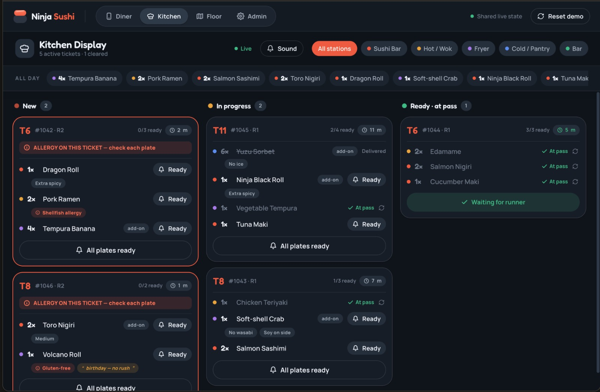
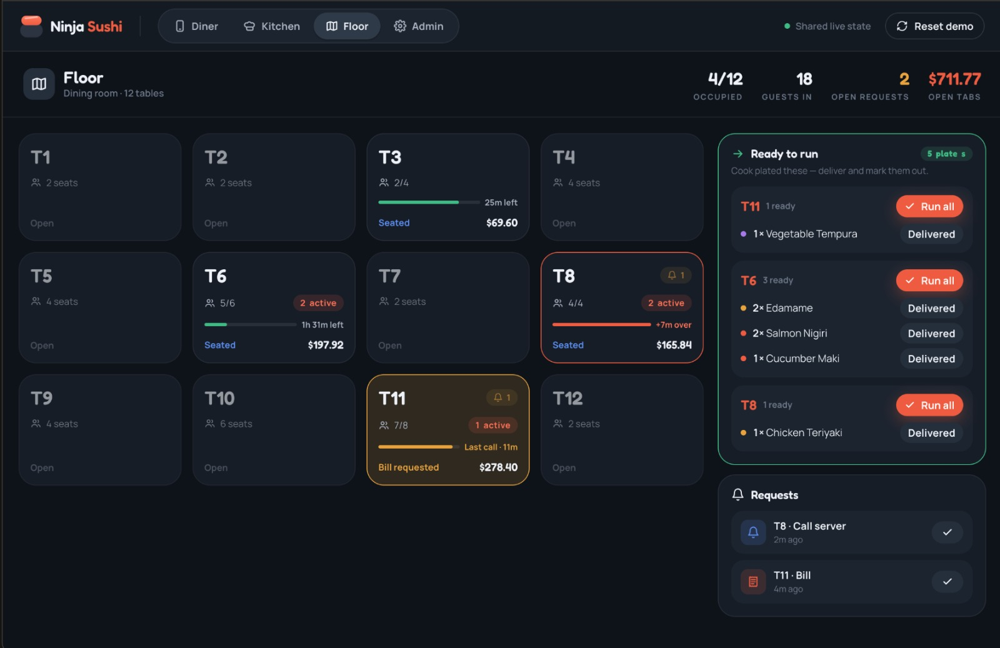
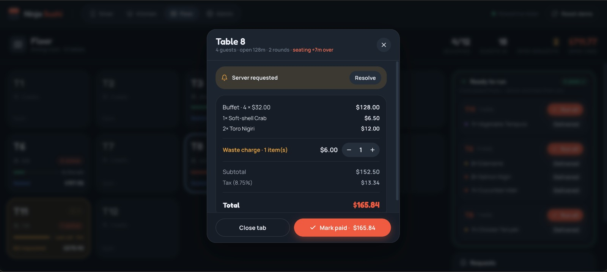

#Link Online
[Figma with mockups] 
(https://www.figma.com/design/IM3flnknRn1nW73Ub7L4sw/Estagio-ACIN?node-id=0-1&p=f&t=iug0uEFBvE4khbIN-0)

[Interface do Cliente] 
(https://www.figma.com/make/03XiqimmQX8rbpvLqEFuSB/Digital-Menu-Interface?p=f)

[Interface do Garçom 1] 
(https://lovable.dev/projects/61f9f077-fd0f-483f-abf1-aff6a9aea5fc)

[Interface do Kitchen 1] 
(https://lovable.dev/projects/8166d770-b3bf-49dd-a27b-e7a3b068084d)

[login mockup] 
(https://www.figma.com/make/UOHuL3CyOfRQmZXKRosf9w/Employee-Login-Screen-Design?p=f)

[Documento de Modelação]
(https://docs.google.com/document/d/1SZVjhM78A9_HxMaj-1IPRET08OsjaqXAvmOX8l8N-VY/edit?tab=t.0)

#Local
Imagens 

