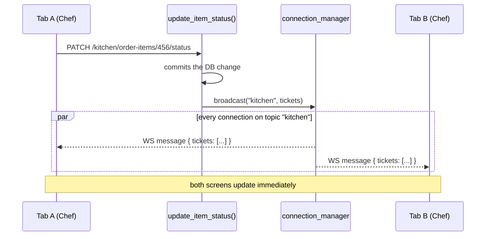

# Real-Time Updates (WebSockets)

This document explains how real-time push works in this project — the shared plumbing (`ConnectionManager`), and the Kitchen module's use of it as the reference example. If you're adding a real-time channel to the **staff** or **client** module (or any future one), read this first — the goal is to reuse the same pattern, not invent a new one.

**Scope:** covers the generic connection registry, the Kitchen implementation built on top of it, and a step-by-step recipe for adding your own topic. It does **not** cover scaling to multiple backend workers/processes — see [Known limitations](#known-limitations).

## The short version

- Real-time push replaces (well, backs up) polling: instead of the frontend asking "anything new?" every few seconds, the backend tells connected clients the moment something changes.
- Connections are grouped by **topic** (a plain string, e.g. `"kitchen"`). A client only receives messages sent to the topic(s) it connected to.
- Every push is a **full snapshot**, not a diff — the frontend just replaces its state with whatever arrives.
- The frontend keeps a REST poll running too (every 30s), as a safety net in case the WebSocket connection is down.
- `ConnectionManager` (`app/core/websocket_manager.py`) is generic and already reusable — you should not need to modify it to add a `staff` or `client` topic.

## How a message travels (Kitchen example)



## File map

| File | What it's for |
|---|---|
| `app/core/websocket_manager.py` | **Reusable.** `ConnectionManager`: tracks connections per topic, `connect()`/`disconnect()`, and `broadcast()` — the one thread-safe entry point for triggering a push from ordinary (synchronous) code. |
| `app/api/deps.py` → `authenticate_staff_websocket()` | **Reusable for any staff-role topic.** Cookie/JWT check for a WebSocket handshake — the WS equivalent of `get_current_staff()`. Not usable as-is for `client` (see the [client note](#a-note-for-client) below). |
| `app/modules/kitchen/websocket.py` | **Kitchen-specific.** The actual `/api/kitchen/ws` endpoint: authenticates, checks role, registers the connection, waits for disconnect. This is the file you copy per module. |
| `app/modules/kitchen/service.py` | **Kitchen-specific.** Home of `broadcast_active_tickets()`, the shared helper that builds a fresh snapshot and calls `connection_manager.broadcast()`. Used by `update_item_status()` after a status change commits, and by `create_order()` below after a new order commits — both push to the same `"kitchen"` topic, since both change what the board shows. |
| `app/modules/client/routes/orders.py` → `create_order()` | **Cross-module call.** Calls `broadcast_active_tickets()` after committing a new order. A new order is a new ticket — the board needs to hear about it just as fast as a status change. |
| `app/api/router.py` | Mounts the WS router alongside the REST one. |
| `app/main.py` | `lifespan` calls `connection_manager.bind_loop(...)` once at startup — without this, `broadcast()` is a silent no-op. |
| `frontend/.../hooks/useKitchenTicketsFeed.ts` | **Copy per module.** Opens the WebSocket, applies incoming snapshots, reconnects with backoff, and keeps the 30s backup poll. Its exported shape (`{ tickets, isLoading, error, refetch }`) is unchanged from the polling-only version — nothing downstream had to change when this was added. |

## Adding a topic for your module

1. **Pick a topic name.** A plain string constant, e.g. `STAFF_TOPIC = "staff"`. Use something more specific (`f"client:{table_id}"`) if a connection should only see events for its own table/session, not everyone's.
2. **Handle the auth handshake.**
   - Staff-role topics: reuse `authenticate_staff_websocket()` as-is (same cookie).
   - Client (guest) topics: you need a different helper — see the [note below](#a-note-for-client).
3. **Create `websocket.py` in your module**, following `kitchen/websocket.py`:

   ```python
   from fastapi import APIRouter, WebSocket, WebSocketDisconnect
   from app.api.deps import authenticate_staff_websocket
   from app.core.websocket_manager import connection_manager

   STAFF_TOPIC = "staff"
   ws_router = APIRouter(prefix="/staff", tags=["Staff"])

   @ws_router.websocket("/ws")
   async def staff_websocket(websocket: WebSocket) -> None:
       staff = await authenticate_staff_websocket(websocket)
       if staff is None or <your role check>:
           await websocket.close(code=1008)  # policy violation
           return

       await connection_manager.connect(STAFF_TOPIC, websocket)
       try:
           while True:
               await websocket.receive_text()  # keeps the connection open
       except WebSocketDisconnect:
           connection_manager.disconnect(STAFF_TOPIC, websocket)
   ```

4. **Register the router** in `app/api/router.py`, same as `kitchen_ws_router`.
5. **Call `connection_manager.broadcast(YOUR_TOPIC, payload)`** at the point in your service layer where the relevant state actually changes — after the DB commit, never before (if the commit fails, nothing should broadcast).
6. **Copy `useKitchenTicketsFeed.ts`** into your module's hooks, rename it, and change the WS URL suffix (`/staff/ws`) and the payload type. The reconnect/backoff logic doesn't need to change.

### A note for `client`

Guests don't have a staff cookie — they authenticate with an `X-Device-Token` header (see `app/modules/client/dependencies.py`). The browser's native `WebSocket` API **cannot send custom headers** on the handshake, so you can't reuse `authenticate_staff_websocket()` or the header-based pattern as-is. You'll need to pass the device token another way — typically a query string parameter (`/client/ws?device_token=...`) read on the server side during the handshake, or a first message sent right after connecting.

## Known limitations

- **Single-process only.** `connection_manager` is an in-memory singleton scoped to one Python process. With a single `uvicorn` worker (the default, and what we run today) this is a non-issue. If the backend ever runs with `--workers N` or multiple containers, each process gets its own isolated registry — a broadcast on one worker never reaches a client connected to another. Fixing that needs a shared layer (e.g. Redis Pub/Sub) between workers; not needed until that becomes a real deployment shape.
- **No delta updates.** Every broadcast is a full snapshot of the relevant state. Fine at today's scale; would need revisiting if a topic's payload gets large.

## Gotcha: time-based checks need their own heartbeat

Kitchen's notifications include a purely time-based rule — "this item has been `Ready` for over a minute, nag about it." Before WebSockets, this worked by accident: the frontend polled every 10s no matter what, so the check re-ran on a steady clock for free.

Switching the primary transport to event-driven push removes that free heartbeat. `detectNotificationEvents()` only reruns when `feed.tickets` changes — and `feed.tickets` now only changes when a WS message arrives, or the backup poll fires (every 30s, and *only* if nothing else already updated it). This created two real gaps, both since fixed:

1. **A new order never triggered a broadcast at all.** `create_order()` committed data the kitchen board cares about, but nothing told `connection_manager` — so "new order" notifications stayed on the 30s backup poll, no faster than before WebSockets existed. Fixed by having `create_order()` call `broadcast_active_tickets()` too (see file map above).
2. **The "ready too long" check lost precision.** With no other activity, it could fire up to 30s late instead of ~10s late. Fixed in `useKitchenTickets.ts` with a dedicated `setInterval` (`NOTIFICATION_CHECK_INTERVAL_MS`, 10s) that reruns the same detection independently of whether new data arrived — tied to the wall clock, not to how often the server happens to push.

**The general lesson:** if you add a time-based check (a threshold, a "been in this state too long" alert) anywhere downstream of a WebSocket feed, don't assume the feed itself is a reliable heartbeat — pushes only fire when something changes. Give the check its own timer.

## Testing

- `tests/test_websocket_manager.py` tests `ConnectionManager` in isolation with a fake WebSocket double — no FastAPI app involved.
- `tests/test_websocket_auth.py` tests `authenticate_staff_websocket()`. Most cases mock `_load_staff_by_id` directly; **one test uses a real DB session** (`test_load_staff_by_id_eager_loads_staff_role_so_it_survives_session_close`) — keep at least one test like this per auth helper you add.
- `tests/test_kitchen_websocket.py` tests the endpoint itself via `TestClient(app).websocket_connect(...)`, with `authenticate_staff_websocket` mocked at the module level.
- `tests/test_kitchen_transitions.py` and `tests/test_client_order_broadcast.py` test the two `broadcast_active_tickets()` call sites — both mock `connection_manager.broadcast` and assert it fires (or doesn't) at the right moments, without a real WebSocket connection.
- `useKitchenTickets.test.ts` has a fake-timers test proving the "ready too long" notification fires from time passing alone, with `feed.tickets` never changing — the regression test for the heartbeat gotcha above.

**A different gotcha, on the auth side this time:** if your auth helper opens its own short-lived DB session (as `_load_staff_by_id` does — a WebSocket handshake has no request-scoped session to reuse), any relationship you touch *after* that session closes (e.g. `staff.staff_role`) must be eager-loaded (`joinedload(...)`) up front. Otherwise it raises `DetachedInstanceError` on every real connection attempt — and none of the mocked tests above will catch it, because they never exercise the real session lifecycle. This exact bug shipped once in Kitchen and only showed up manually, in a real browser, against a real database.

## See also

- `docs/kitchen-backend.md` — the REST endpoints and service layer this module's broadcasts hook into.
- `docs/kitchen-frontend.md` — the ticket board that consumes `useKitchenTicketsFeed.ts`.
